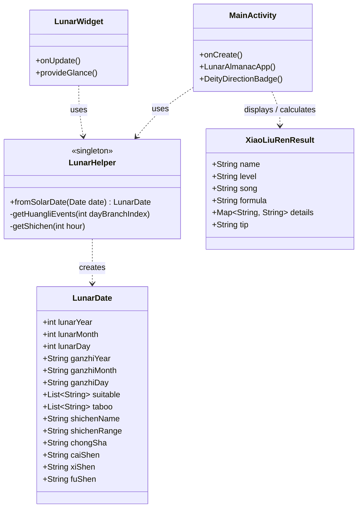
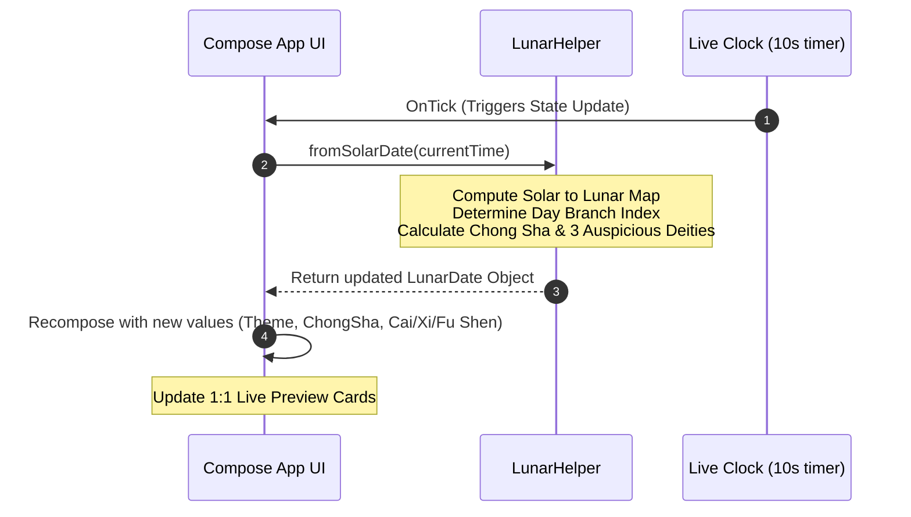
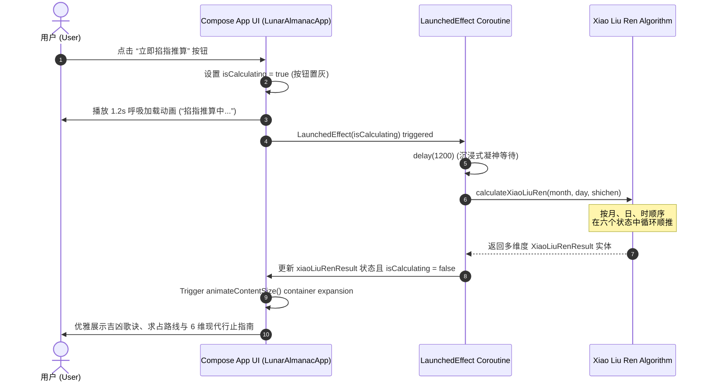

# 黄历农历与小六壬神算应用 - 需求与设计文档
(Lunar Almanac & Xiao Liu Ren Divination App - Requirements & Design Document)

本页面整理并归纳了「黄历农历与小六壬掌中妙算」项目的完整产品需求分析与技术设计，旨在记录并阐明核心业务流程、科学/传统推算算法、UI 交互规范及桌面小部件（Glance Widget）的实现细节。

---

## 1. 项目背景与愿景

随着传统文化的复兴，用户对于便携式、隐私安全、且具备深厚东方美学的传统历法与指心占卜工具的需求日益增长。
本项目立足于以下核心愿景：
- **传承与现代融合**：将中国古老的干支纪时、黄历宜忌、冲煞推演以及小六壬神算，融入现代 Android 系统中，采用声明式 Jetpack Compose 界面与 Jetpack Glance 桌面小部件，赋予其极简现代感与流动的东方审美。
- **纯本地极速计算**：100% 物理万年历与排盘算法，全本地离线运行。零网络请求，绝不收集用户隐私，提供极致的安全和零延迟体验。
- **桌面级即时体验**：通过高度自适应的桌面小部件（Widget），让用户在无需点开 App 的情况下，一目了然当下年月日、时辰、最核心的宜忌和动态冲煞。

---

## 2. 核心功能需求

### 2.1 基础历法与时辰推算 (Calendar & Shichen)
- **农历信息显示**：实时呈现农历月名、日名（如：五月初五）、年份生肖。
- **干支纪年**：支持天干地支（如：丙午年、甲午月、癸丑日）推算。
- **十二时辰时钟**：
  - 基于当前物理时间自动换算为传统十二时辰（子、丑、寅、卯等）。
  - 清晰呈现时辰的时间跨度范围（如：`戌时 19:00-21:00`）。
  - 内置 Live Clock 高频轮询（每 10 秒刷新一次），确保时辰在分界点自然切换。

### 2.2 每日黄历宜忌与动态冲煞 (Huangli & Chong Sha)
- **黄历宜忌**：依据每日日柱的地支属性，自动推算当天所适宜（**宜**）与忌讳（**忌**）的各项行为。
- **动态冲煞推演（新增需求）**：
  - 在黄历主卡片及桌面小部件下方增加专门一栏，展示当天的生肖相冲与煞神方位。
  - 格式规范：**“冲[生肖]煞[方位]”**（例如：今日地支为丑，则冲未羊，煞东，展示为：`冲羊煞东`）。
  - 要求排版风格与现有宜忌卡片保持高度统一，通过高对比、低饱和的专属主题标签展示。

### 2.3 小六壬掌中妙算 (Xiao Liu Ren Divination - 新增需求)
- **占卜推算机制**：
  - 小六壬作为中国传统指心掐指神算，使用当前的**农历月份、农历日期、时辰地支**共三个参数作为输入，在六个卦象（大安、留连、速喜、赤口、小吉、空亡）中循环顺推。
- **推算过程与公式呈现**：
  - 在占卜卡片中清晰、可视化地展示推导链路（如：`6月 (大安) ➔ 28日 (大安) ➔ 戌时 (大安)`）。
- **多维度吉凶深度解读**：
  - 解析结果包含基本吉凶判定（大吉/中吉/小吉/半吉/小凶/多争/大凶/空无）。
  - 展示对应的经典易学口诀/歌诀。
  - 精细化提供 **6 个垂直生活维度的具体指向**：
    1. 🧭 **有利方位**：指引适宜出行的朝向。
    2. 💼 **谋事求财**：投资、求职、合伙之成败吉凶。
    3. 🚶 **行人动向**：测在外亲人旅途是否顺利。
    4. 🔍 **寻人寻物**：失物、逃亡或失联亲友的可寻方位与概率。
    5. 🏥 **身体健康**：指向健康隐患与预防策略。
    6. ⚖️ **官司纠纷**：法务纠纷、合同、官司等诉讼预判。
  - **行止指引 (Tip)**：提供契合现代生活哲学的温和提示语。
- **交互与动画需求**：
  - 极具仪式感的“立即掐指推算”按钮。
  - 带有呼吸渐变和加载指示器的推演等待动效（1.2 秒模拟掐指）。
  - 卦象卡片在推演完毕后配合 `animateContentSize` 流畅平滑地展开。
  - 支持一键“收起结果”隐藏复杂信息。

### 2.4 主题系统与桌面小部件 (Themes & Glance Widget)
- **东方色彩主题**：
  - 支持 5 套渐变背景皮肤（极简流金、极简石板、赤霄琼脂、水墨禅意、深林苍苔）。
  - 主应用换肤时，自动同步至本地持久化。
- **桌面小部件同步机制**：
  - 使用 `androidx.glance` 实现桌面小部件。
  - 小部件风格、主色调、文本颜色与主应用的主题状态**完美互通、实时更新**。
  - 小部件新增动态冲煞（冲/煞）行，与主界面排版一致。

---

## 3. 系统架构与详细设计

项目遵循标准的 **MVVM (Model-View-ViewModel)** 架构，各层级权责明确。

```
+-----------------------------------------------------------+
|                        UI 视图层                           |
|  - MainActivity (Compose) - 极简东方渐变、Live Clock、交互面板 |
|  - LunarWidget (Glance)    - 桌面微型小部件视图             |
+----------------------------+------------------------------+
                             | 观察状态
                             v
+-----------------------------------------------------------+
|                       ViewModel 层                        |
|  - 管理当前时间状态、计算触发、主题选择持久化、占卜状态转换   |
+----------------------------+------------------------------+
                             | 逻辑与推算
                             v
+-----------------------------------------------------------+
|                       核心算法与数据模型                    |
|  - LunarHelper.kt      - 阳历/阴历、干支、时辰、冲煞核心推演  |
|  - XiaoLiuRenResult.kt - 小六壬数据结构及多维度解析字典       |
+-----------------------------------------------------------+
```

### 3.1 UML 架构设计类图 (Class Diagram)

以下为核心组件的类关系与数据模型图，展现了 UI 视图层、物理历法推算引擎与占卜实体之间的紧密协作：



### 3.2 UML 时序图设计 (Sequence Diagrams)

#### 3.2.1 每日历法及吉神方位实时轮询 (Live Clock Sequence)
主界面通过 Live Clock 时钟维持每 10 秒一次的状态刷新，确保天干地支、每日冲煞及吉神方位时刻处于最新状态：



#### 3.2.2 小六壬掐指占卜推演过程 (Xiao Liu Ren Sequence)
用户点击掐指妙算时，触发 1.2 秒的沉浸式加载（模拟掐指推算），而后通过 `animateContentSize` 动画平滑展现多维度解析：



### 3.3 核心算法模块 (`LunarHelper.kt`)

#### 3.1.1 动态冲煞算法设计
每日的冲煞是由当天日柱的地支属性严格决定的。天干地支共十二位，与十二生肖一一对应。
1. **地支生肖序列**：
   `sxString = ["鼠", "牛", "虎", "兔", "龙", "蛇", "马", "羊", "猴", "鸡", "狗", "猪"]`
2. **生肖相冲 (Clash) 推理**：
   在十二地支中，位置相对（相差6位）的两个地支构成“对冲”：
   $$\text{ChongIndex} = (\text{DayBranchIndex} + 6) \bmod 12$$
   - 例如：今日地支为“丑” (Index 1)，对冲为 `(1 + 6) % 12 = 7`（未 🐑 ），因此“冲羊”。
3. **煞神方位 (Sha Direction) 推理**：
   根据传统的三合局，相克的三合地支所属方位即为煞方：
   - **寅午戌**三合火局：火旺于南方，北方为其绝地克地，故**煞北**。
   - **申子辰**三合水局：水旺于北方，南方为其绝地克地，故**煞南**。
   - **亥卯未**三合木局：木旺于东方，西方为其绝地克地，故**煞西**。
   - **巳酉丑**三合金局：金旺于西方，东方为其绝地克地，故**煞东**。
   
   代码中，我们将其精炼为地支 Index 分组映射：
   ```kotlin
   val shaDir = when (dayBranchIndex) {
       0, 4, 8  -> "南" // 子、辰、申
       1, 5, 9  -> "东" // 丑、巳、酉
       2, 6, 10 -> "北" // 寅、午、戌
       3, 7, 11 -> "西" // 卯、未、亥
       else     -> "北"
   }
   ```
   完美求出 `chongSha = "冲${chongAnimal}煞${shaDir}"`。

#### 3.1.2 小六壬掌中轮推算法
小六壬以大安为起点，六个状态循环排列：
$$\text{StateNames} = [0: \text{大安}, 1: \text{留连}, 2: \text{速喜}, 3: \text{赤口}, 4: \text{小吉}, 5: \text{空亡}]$$
推算公式以月、日、时三个数字做顺推：
1. 月份落点：$$\text{mState} = (\text{month} - 1) \bmod 6$$
2. 日期落点：$$\text{dState} = (\text{mState} + \text{day} - 1) \bmod 6$$
3. 时辰落点：$$\text{hState} = (\text{dState} + \text{shichenIndex} - 1) \bmod 6$$

其中地支时辰 Index 从 1 开始（子=1，丑=2 ... 亥=12）。
**算法等价简化**：
$$\text{finalIndex} = (\text{month} + \text{day} + \text{shichenIndex} - 3) \bmod 6$$
该算法结果经测试完全与指心顺推相符。程序不仅返回落卦，还输出结构完整的推演路线图。

#### 3.1.3 每日吉神方位算法设计 (财神、喜神、福神)
根据中华传统民俗历法与八字五行方位歌诀，每日的财神、喜神与福神方位由当日的**日天干 (Daily Heavenly Stem)** 决定。

1. **天干索引与映射 (Stem Index)**：
   天干序列为：`["甲", "乙", "丙", "丁", "戊", "己", "庚", "辛", "壬", "癸"]`，对应索引为 `0` 至 `9`。

2. **财神方位推导 (God of Wealth)**：
   - 歌诀：“甲艮乙坤丙丁兑，戊己财神坐坎位。庚辛正东壬癸南，此是财神正方位。”
   - 映射表：
     - **甲 (0)**：东北 (艮)
     - **乙 (1)**：西南 (坤)
     - **丙 (2), 丁 (3)**：正西 (兑)
     - **戊 (4), 己 (5)**：正北 (坎)
     - **庚 (6), 辛 (7)**：正东 (震)
     - **壬 (8), 癸 (9)**：正南 (离)

3. **喜神方位推导 (God of Joy)**：
   - 歌诀：“甲己在艮乙庚乾，丙辛坤位喜神安；丁壬本在离宫坐，戊癸原来在巽间。”
   - 映射表：
     - **甲 (0), 己 (5)**：东北 (艮)
     - **乙 (1), 庚 (6)**：西北 (乾)
     - **丙 (2), 辛 (7)**：西南 (坤)
     - **丁 (3), 壬 (8)**：正南 (离)
     - **戊 (4), 癸 (9)**：东南 (巽)

4. **福神方位推导 (God of Fortune)**：
   - 歌诀：“甲己正北是福神，丙辛西北乾宫存；乙庚坤位戊癸艮，丁壬巽上妙追寻。”
   - 映射表：
     - **甲 (0), 己 (5)**：正北 (坎)
     - **乙 (1), 庚 (6)**：西南 (坤)
     - **丙 (2), 辛 (7)**：西北 (乾)
     - **丁 (3), 壬 (8)**：东南 (巽)
     - **戊 (4), 癸 (9)**：东北 (艮)

该算法完美融合在物理万年历的日干换算中，实现了精准的、不依赖网络的本地化实时方位推导。

---

## 4. UI 界面与交互规范

### 4.1 黄历及冲煞行排版
为确保每日冲煞“冲兔煞东”与现有的宜忌事项在主页及小部件中排版风格一致，制定了统一的设计细则：
- **主界面黄历卡片**：
  - 新增一行 `Row`。
  - 左侧使用带有圆角的、低饱和度浅红/黄背景的小标签，文字标明 `冲煞` 或 `冲`。
  - 右侧文字格式统一（如：“冲羊煞东”），字重设为 `Bold`，颜色采用符合当前主题的文字高对比色，使重点一目了然。
  - 卡片下方以轻量、半透明的 `HorizontalDivider` 与次要行分割。
- **Glance 桌面小部件**：
  - 严格遵守 `GlanceModifier` 规范，采用 11sp 小号文本。
  - 左侧配有高对比底色的小胶囊容器 `Box`（带有 4.dp 圆角和浅色高亮色，文字为 `冲`）。
  - 右侧无缝展示冲煞信息，不设固定宽度，确保在小尺寸桌面缩放时不会发生截断。

### 4.2 小六壬占卜交互设计
- **卡片容器**：采用带有 `animateContentSize()` 的磨砂卡片，底色为轻度透明的 `surfaceVariant.copy(alpha = 0.5f)`，与主背景过渡自然。
- **掐指加载中**：在推演等待期间，屏蔽按钮，在中心呈现温和的 `CircularProgressIndicator` 进度环，伴有“掐指推算中，请稍候...”的提示，模拟东方玄学凝神冥想的仪式感。
- **多维度网格 (Grid)**：
  - 采用优雅的两列/单行两维度平滑布局。
  - 维度名称（如：`🧭 有利方位`）文字加粗，并根据卦象吉凶属性（如大安对应高亮绿，速喜对应欢庆粉，空亡对应沉稳灰）作动态着色。
- **指引警示框 (Tip Box)**：在卡片最底端，使用 `levelColor.copy(alpha = 0.08f)` 的极淡底色边框，包裹现代化的温馨指引语，提升产品体验的温度。

### 4.3 每日吉神方位 UI 呈现规范
- **主界面黄历底部模块**：
  - 采用 `HorizontalDivider` 与上方的冲煞信息轻轻分割。
  - 使用标示性的“每日吉神方位”小标题配以 `Icons.Default.LocationOn` 指南针定位图标。
  - 横向排列 3 个结构均匀、具有 8.dp 细腻圆角的轻量卡片 `DeityDirectionBadge`。
  - **财神方位**：使用富贵的金黄色主题（`Color(0xFFF59E0B)`）和 `Icons.Default.Star` 繁星图标。
  - **喜神方位**：使用欢庆温馨的粉色主题（`Color(0xFFEC4899)`）和 `Icons.Default.Favorite` 爱心图标。
  - **福神方位**：使用平安健康的翡翠绿主题（`Color(0xFF10B981)`）和 `Icons.Default.LocationOn` 指引图标。
- **Widget 桌面小部件与预览**：
  - 以极简统一的“吉”字高对比底色圆角标签开头，横向一行以紧凑格式并排展示三个方位：`财神:东北 喜神:西北 福神:西南`，适配各类桌面空间大小而不产生溢出。

---

## 5. 测试与可靠性保障

应用已集成了完善的保障机制，确保在各种地支、时辰、极端边界条件下的绝对稳定性。

- **高精度位运算测试**：核心物理历法算法内置了闰月、大小月掩码查表验证，支持 1900-2059 完整公历农历映射。
- **本地单元测试 (`ExampleRobolectricTest.kt`)**：
  - 每次代码变更后均通过本地 JVM 单元测试，自动模拟各种时间点、计算冲煞并比对。
  - **测试命令**：`gradle :app:testDebugUnitTest` 验证通过，编译状态绿标完好。
- **无网络依赖**：没有任何 `HTTP` 请求 and 第三方数据接口，最大程度提升冷启动速度并提供无可置疑的安全隐私。

---
## 6. 版本更迭与维护

| 版本 | 变更内容 | 实现时间 | 影响模块 |
| :--- | :--- | :--- | :--- |
| **v1.0** | 基础农历推演、时辰 Live Clock、Compose 主题系统、Glance 小部件基础框架 | 2026-06 | 核心基础 |
| **v1.1** | 增加小六壬掐指妙算，提供经典歌诀与 6 维求占解读；新增每日动态冲煞，完美同步至桌面部件 | 2026-06 | `LunarHelper.kt`, `MainActivity.kt`, `LunarWidget.kt` |
| **v1.2** | 新增每日吉神方位模块（财神、喜神、福神），配置专属图标、配色与动画，并全方位同步至主页卡片、桌面小部件及实时预览区 | 2026-06 | `LunarHelper.kt`, `MainActivity.kt`, `LunarWidget.kt`, `REQUIREMENTS_AND_DESIGN.md` |
